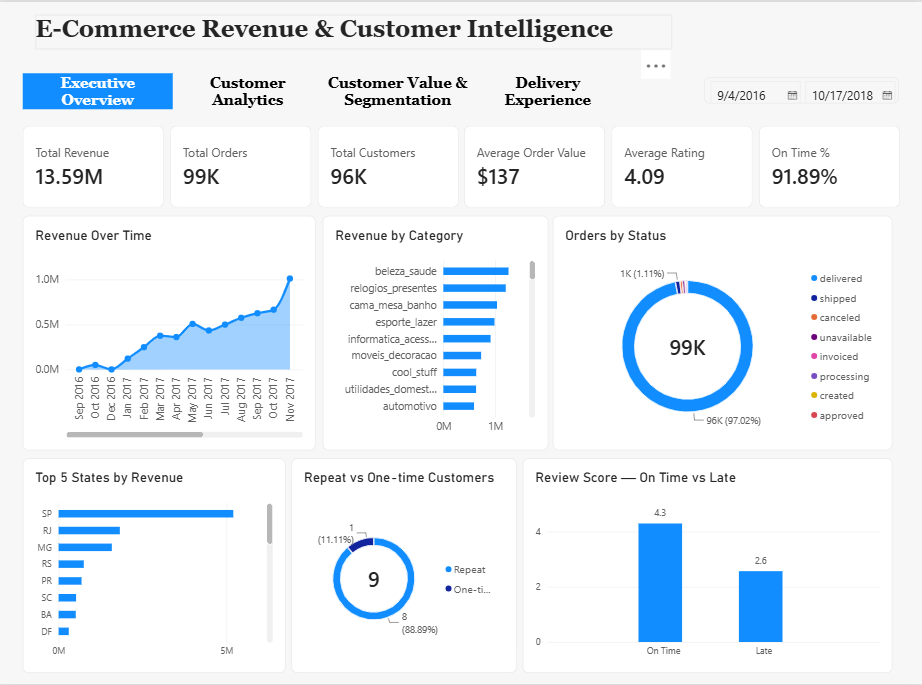
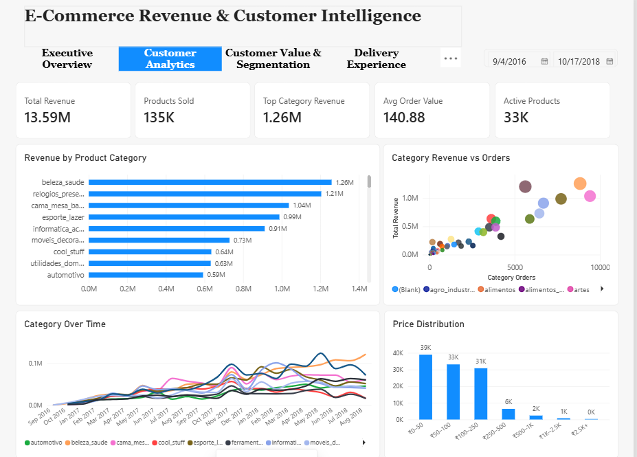
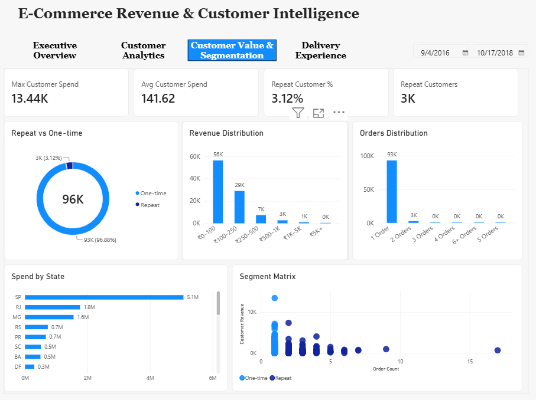
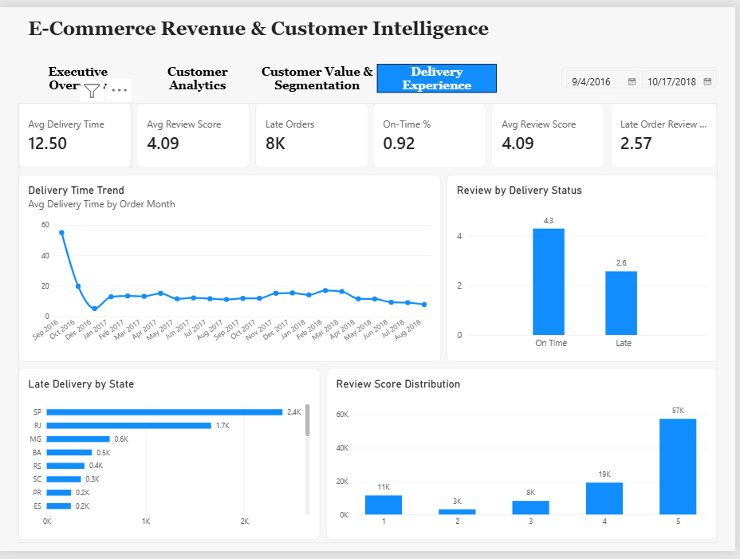

# E-Commerce Revenue & Customer Intelligence

## 📊 Project Overview

An end-to-end e-commerce analytics project built using Python, SQL,
Power BI and DAX using the Brazilian E-Commerce Public Dataset by Olist.

The project analyzes approximately 100K orders to understand revenue
drivers, product/category performance, customer behavior, delivery
efficiency and customer satisfaction.

---

## 📂 Dataset

This project uses the Brazilian E-Commerce Public Dataset by Olist.

The raw CSV files are not included in this repository to keep the
repository lightweight. The analysis was performed using the original
Olist relational datasets.

---

## 🎯 Business Questions

- What are the main revenue-driving categories?
- Which states generate the highest revenue?
- How do customers differ in purchasing behavior?
- What percentage of customers are repeat customers?
- Which products/categories contribute most to revenue?
- How efficiently are orders being delivered?
- Does late delivery affect customer satisfaction?

---

## 🛠️ Tools & Technologies

- Python
- Pandas
- NumPy
- SQL Server
- Power BI
- DAX
- Power Query
- Git/GitHub
---

## 🔄 Data Workflow

Raw Olist CSV Files
        ↓
Python / Pandas
        ↓
Data Cleaning & Transformation
        ↓
SQL Analysis
        ↓
Power BI Data Model
        ↓
DAX Measures
        ↓
Interactive Dashboard
        ↓
Business Insights

---

## 🧹 Data Preparation

Python and Pandas were used to:

- Inspect dataset structure and data types
- Identify duplicates and missing values
- Convert date fields
- Validate relationships between datasets
- Create delivery-performance metrics
- Calculate order value and freight percentage
- Create customer-type classifications
- Standardize product category information

### Key Derived Metrics

- Order Value
- Delivery Days
- Estimated Delivery Days
- Delivery Delay
- Delivery Status
- Freight Percentage
- Customer Type
- Order Year
- Order Month
- Order Quarter

---

## 🗄️ SQL Analysis

### SQL Implementation

The SQL analysis scripts are available in:

`sql/01_sql_analysis.sql`

The analysis uses SQL Server syntax and covers data validation,
revenue analysis, customer analysis, product analysis and
delivery/customer-experience analysis.

SQL was used to analyze:

### Revenue
- Monthly revenue
- Revenue by category
- Revenue by state
- Average Order Value
- Top products

### Customer Analytics
- Customer order frequency
- One-time vs repeat customers
- Customer spending
- Customer distribution by state

### Product & Seller Performance
- Category revenue
- Seller revenue
- Product performance
- Order distribution
- Price distribution

### Delivery & Customer Experience
- Average delivery time
- Late-delivery percentage
- Delivery performance by state
- Review score distribution
- Delivery status vs review score

---

# 📊 Power BI Dashboard

The dashboard contains four analytical pages.

## 1. Executive Overview

Key KPIs:

- Total Revenue: 13.59M
- Total Orders: ~99K
- Total Customers: ~96K
- Average Order Value: ~137
- Average Rating: ~4.09
- On-Time Delivery: ~92%

Visuals include:

- Revenue over time
- Revenue by category
- Orders by status
- Top states by revenue
- Repeat vs one-time customers
- Review score by delivery status



---

## 2. Product & Category Performance

Key metrics include:

- Total Revenue
- Products Sold
- Top Category Revenue
- Average Order Value
- Active Products

Visuals include:

- Revenue by product category
- Category revenue vs orders
- Category performance over time
- Product price distribution



---

## 3. Customer Value & Segmentation

Key metrics include:

- Maximum Customer Spend
- Average Customer Spend
- Repeat Customer Rate
- Repeat Customers

Visuals include:

- One-time vs repeat customers
- Customer revenue distribution
- Order frequency distribution
- Spend by state
- Customer segmentation matrix



---

## 4. Delivery & Customer Experience

Key metrics include:

- Average Delivery Time
- Average Review Score
- Late Orders
- On-Time Delivery %
- Late Order Review Score

Visuals include:

- Delivery time trend
- Review score by delivery status
- Late delivery by state
- Review score distribution



---

# 💡 Key Business Insights

### 1. Revenue concentration

Revenue is concentrated among several leading product categories, with
Beauty & Health, Watches & Gifts, and Bed/Bath/Table among the
highest-revenue categories.

### 2. Customer retention

Repeat customers represent approximately 3.1% of the analyzed customer
base, indicating a predominantly one-time customer purchasing pattern.

### 3. Geographic concentration

São Paulo contributes the largest share of customer spend/revenue,
followed by Rio de Janeiro and Minas Gerais.

### 4. Delivery performance

Approximately 92% of analyzed delivered orders were classified as
on-time, while around 8K orders were identified as late.

### 5. Delivery and customer satisfaction

Average review scores were substantially different between on-time
and late deliveries:

- On-time orders: 4.3
- Late orders: 2.6

This indicates a strong association between delivery performance and
customer satisfaction within the analyzed dataset.

---

# 📌 Business Recommendations

- Investigate the causes of late deliveries in high-volume states.
- Analyze repeat-purchase behavior to identify opportunities for
  improving customer retention.
- Monitor high-revenue categories for changes in demand and order volume.
- Prioritize logistics analysis for regions with high order volumes
  and weaker delivery performance.
- Track delivery performance alongside customer review scores as a
  customer-experience KPI.

---

# 📁 Project Structure

```text
olist-ecommerce-analytics/
│
├── docs/
│   ├── executive_overview.png
│   ├── product_category_performance.png
│   ├── customer_value_segmentation.png
│   └── delivery_customer_experience.png
│
├── notebooks/
│   └── 01_data_cleaning.ipynb
│
├── sql/
│   └── 01_sql_analysis.sql
│
├── .gitattributes
├── .gitignore
├── E-commerce Revenue & Customer Intelligence.pbix
└── README.md